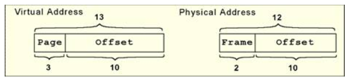

# Memory

## Types fo Memory

- RAM(random access memory)
- ROM(Read Only memory)

There are two types of RAM , dynamic RAM(DRAM) and static RAM(SRAM).

- Dynamic RAM(DRAM) consists of capactiors(电容).Thus they must be **refreshed every few miliseconds** to prevent data loss.
- DRAM is cheap and slower than SRAM.
- SRAM holds its contents as long as poewr is available.
- DRAM can store mant bits per chip,uses less power,generates less heat than SRAM.
- DRAM for main memory and SRAM for cache.

ROM is not volatile , it always retains its data.

## The Memory Hierarchy(层次结构)

To provide the most benificial, memory is organized in a hierarchical fashion.

And hierachical memory system include:

- registers,cache,main memory,secondatry memory.

- To access a piece of data, the CPU first send a request to its nearest memory,usually cache.
- If data is not in cache , found in main memory,if not in memory,found in disk.
- Once the data is founded,then a number of **its nearby data are fetched into cache.**

### Somde definitions

- A **hit** is when data is found at a given memory level.
- A **miss** is when it is not found.
- The **hit rate** is the percentage of time data is found at a give memory level.
- The **miss rate** is the percentage of time it is not found at a give memory level.
- The **hit time** is the time required to access data at given memory level.

### Locality of Reference(引用的局部性)

- The principle of locality tells us that once a byte is accessed,it is likely that a nearby data element will be needed soon.**So an entired blocks of data is copied after a hit.**
- There are three forms of locality:
    - **Temporal locality** Recently-accessed data elements tend to be accessed **again**.
    - **Spatial locality** Accessed tend to cluster(对存储器空间的访问有集中成簇的倾向)
    - **Sequential locality(顺序局部性)** Instructions tend to be accessed sequentially.

## Cache Memory

Cache uses the locality principle and transfers an entire block from main memory into cache.If the probability of using something else in that block is high, **then transferring the entire block saves on access time.**

The cache location for this new block depends on two things:

- The cache mapping policy(Cache的映射策略)
- The cache size(Cache的大小)

### Difference between cache and main memory

- main memory: accessed by address.
- Cache: accessed **by content**,called content addressable memory or **CAM**.

### Cache Mapping Schemes

- If the data has been copied to cache, the address of the data in cache is **not the same as the main memory address**.
- The CPU uses a specific mapping scheme that “converts” the main memory address into a cache location.

- A subset of the bits of a main memory address called a **field(域)**.
- The fields into a memory address provide a **many-to-one** mapping between larger main memory and smaller cache memory.
- Many blocks of main memory map to a single block of cache. So a **tag field(标记域)** in the cache block distinguishes one cached memory block from another.

### How data is copied into cache?

1. Main memory and cache are both **divided into the same size blocks**

    - a memory address is generated
    - search cache first
    - found in cache?
    - not
    - load the entire main memory block in which the word resides into cache.

1. How to use fields in the main memory address?

    - One field of the main memory address points us to a location in cache in which the data resides.(内存地址指向一个cache地址)
    - Then a valid bit(有效位) with each cache block is check to see if the cache block referenced it is valid(检查cache的有效位，验证引用cache的合法性)
    - Then compare the tag in the cache block to the tag field of our address(If same ,cache hit.)
    - using the word field to locate the desired word in the block.(求出数据的块内偏移)

### Direct Mapped Cache(直接映射)

- The simplest cache mapping scheme is direct mapped cache.
- Suppose the cache has N blocks, block X of main memory maps to cache block Y = X mod N.

- Once a block of memory is copied into its slot in cache,**a valid bit is set** for the cache block to let the system know that the block contains valid data.
- direct mapping main memory address partiton:

- word field: identifies a word of a block(偏移)
- block field:identifies a unique block of cache(块在cache中的编号)
- tag field:identifies a block of main memory.
- The size of each field into which a memory address is divided depends on the size of the cache.

Example:

Suppose our memory consists of $2^14$ words,cache has 16=$2^4$ blocks,and each block holds 8 words.

1. block field holds 4 bit.
1. word field holds 3 bit.
1. So tag field holds 14-4-3 = 7 bits.  

### Fully Associative Cache(全关联高速缓存)

- allow a block in memory to go anywhere in cache.
- Cache would have to fill up before any blocks are evicted.
- So,cache would not be replaced until the cache is full.

A memory address is partitioned into only two fields:the tag and the word.

Example:

Supposed we have 14-bit memory addresses and a cache with 16 blocks,each block of size 8. The field format of a memory reference is:

When the cache **is searched**, all tags are searched in parallel to retrieve the data quickly.(并行搜索所有的标签)

- Direct mapped cache evicts(驱逐) a block whenever another memory reference needs that block.(多个内存映射到一个cache地址上)
- fully associative cache(全关联高速缓存) **needs an algorithm** to determine which block to evict from the cache.
- The block that is evited is the **victim block**.

### Set Associative Cache(组关联高速缓存)

- Set associattive cache combines the ideas of direct mapped cache and fully associative cache.(组关联运用全关联和直接映射的思想)
- An N-way set associative cache mapping is like direct mapped cache in that a memory reference maps to a particular location in cache.

- Instead of mapping anywhere in the entire cache , a memory reference can map only to the subset of cache slots.

Example:

a 2-way set associative cache

- In set associative cache mapping , a memory refeence is divided into 3 fields:
    - tag
    - set
    - word

As with direct-mapped cache,the word field chooses the word in the cache block , and the tag field uniquely identifies the memory address.

- The set field determines the set to which the memory block maps.

Example:

Suppose we have a main memory of $2^14$ bytes:

- This memory is mapped to a 2-way set associative cache having 16 blocks where each block contains 8 words.

- There has 16/2=8 set. set bit:3
- Word field: 3 bit.
- Tag field 14-3-3=8 bit.

### Replacement Policies(置换策略)

With fully associative and set associative cache , a **replacement policty** is invoked when it becomes necessary to evict a block from cache(full).

An optimal(best) replacement policy would be able to look into the future to see which blocks won't be needed for the longest period of time.

- A **least recently used** (LRU) algorithm keeps track of the last time that a block was assessed and evicts the block that has been unused for the longest period of time.(驱逐最长时间未使用的块)
- The disadvantage of this approach is its **complexity** : LRU has to maintan an access history for each block,which ultimately **slows down** the cache. 

- First-in,first-out(FIFO)(队列) is a popular cache replacement policy.
- In FIFO,the block that has been in the cache the longest,regardless of when it was last used.(在高速缓存中时间最长的块先被移除)

- A **random replacement policy** does what its name implies: It picks a block at random and replaces it with a new block.
- Random replacement can certainly evict a block that will be needed often or needed soon,but it never thrashes(重复操作).

### Effective Access Time and Hit Ratio(有效存取时间和命中几率)

- The performance of hierarchical memory is measured by its **effective access time(EAT)**.
- EAT is a weighted average that takes into account the hit ratio and relative access times of successive levels of memory.
- The EAT for a 2-level memory is given by:
    - EAT = H ✖ Access_c + (1-H) ✖ Access_mm (H is the cache hit rate)

Example:

Consider a system with a main memory access time of 200ns support by a cache having a 10ns access time and a hit rate of 99%.

The EAT is : 0.99*(10ns)+0.01(200ns) = 9.9ns+2ns=11ns

### When Does Caching Break Down

When programs exhibit locality,caching works quite well.

- However,if programs exhibit bad locality,caching breaks down and the performance of the memory hierarchy is poor.(Object-oriented programming)

### Cache Write Policies

Cache replacement policies must also take into account **dirty blocks**(block data modified),those blocks that have been updated while they were in cache.

- Dirty blocks must be written back to memory.A **write policy** determines how this will be done.
- There are two types of write policies,**write through and write back**(写通和回写)
- **Write through** updates cache and main memory simultaneously(同时) on every write.
- **Write back** updates memory when the block is selected for replacement.
- The disadvantage of write through is that memory must be updated with each cache write,and the disadvantage of write back is that memory does not always agree with the value in cache.

## Virual Memory

Virtual Memory: a portion of a disk drive servers as an extension of main memory.

- Using virtual memory,computer addresses more main memory than it actually has.
- This area on the hard drive is called a **page file**.
- The most common way to implement virtual memory is by using **paging**(分页),a method in which main memory is divided into fixed-size blocks and programs are divided into the same size blocks.

- Main memory and virtual memory are divided into equal sized pages.
- The entire address space required by a process need not be in memory at once.(Some parts can be on disk , while others are in main memory)
- Further,the pages allocated(分配) to a process do not need to be stored contiguously-- either on disk or in memory.
- In this way,only the needed pages are in memory at any time, the unnecessary pages are in slower disk storage.

### Terms for virtual memory

- **Virtual address** The logical or program address that the process uses.Thenever the CPU generates an address,it is always in terms of virtual address space.
- **Physical address** The real address in physical memory.
- **Mapping** Transtate virtual addresses into physical addresses.(similar to cache mapping)
- **Page frames** The equal-size chunks or blocks into which **main memory**(physical memory) is divided.(由主存分成相等大小的信息块或数据块)
- **Pages** The chunks or blocks into which **virtual memory is divided,each equal in size to a page frame**.Virtual pages are stored **on disk** until needed.
- **Paging** The process of **copying** a virtual page **from disk to a page frame** in main memory.
- **Fragmentation**(存储碎片) Memory that becomes unusable.
- **Page fault** An event that occurs when a requested page **is not in** main memory and must be **copied into** memory from disk. 

### Paging

Information concering the location of each page,whether on disk or in memory,is maintained in a data structure called a **page table**.

- There is one page table for each active process.

- Process memory is divided into these fixed size pages,resulting in potential internal fragmentation(内部碎片) when the last page is copied into memory.
- When a process generates a virtual address,the operating system translates it into a **physical memory address.**
- To accomplish this,the virtual address is divided into two fields: **A page field,an offest field**(页域和偏移量域)
- The page field determines the page location of the address.
- The offset indicates the location of address within the page.
- The logical page number is translated into a physical page frame through a lookup in the page table.

Example:

Suppose a system has a virtual address space fo 8K and a physical address space of 4K,and the system uses byte addressing.One page size is 1K.

- We have $2^13$/$2^10=2^3$ virtual pages.
- A virtual address has 13 bits,3 bits for page field and 10 bits for the offset.
- A physical memory address requires 12 bits,the first two bits for the pages(4) and the 10 bits for the offset.

### Effective Access Time Using Paging

We said earlier that effective access time(EAT) takes all levels of memory into consideration.

- Virtual memory is also a factor in the calculation,and we also have to consider page table access time.
- For each memory access there must be two physical memory accesses , one to reference the page table and one to reference the actual data.

Example:

Suppose a main memory access takes 200ns,the page fault rate is 1%,and it takes 10ms to load a page from disk,we have:

EAT = 0.99(200ns+200ns) + 0.01(10ms) = 100,396ns.

- Because page tables are read constantly,it makes sense to keep them in a special cache called a **translation look-aside buffer(TLB)**.
- TLBs are a special associative cache that stores the mapping of virtual pages to physical pages.(TLB通常使用关联)

### Segmentation(分段)

Another approach to virtual memory is **segmentation**.

- virtual address space is divided into **variable-length** segments.
- A segment is located through its entry in a segment table.

- When a segment fault,the operating system searches for a location in memory **large enough** to hold the segment that is retrieved from disk.
- Memory accesses are translated by providing a segment number and an offset within the segment.
- Both paging and segmentation can cause fragmentation.

### Paging Combined with Segmentation

Combined approach:

- the virtual address space is divided into segments of **variable length**.
- the segments are divided into **fixed-size** pages.
- **Main memory** is divided into **the same size** frames.

Each segment has a page table , which means every program has multiple page tables.

The physical address is divided into three fields:

- segment field: points the system to the appropriate page table.
- page number: an offset into this page table.
- offset: in the page.

