# IO and Storge Systems

## Amdahl's Law

The overall performance of a system is a result of the interaction of all its components.

System performance is most effectively improved when the performance of the most heavily used components is improved.

- This idea is quantified by Amdahl's Law:

$$S = \frac{1}{(1-f)+ \frac{f}{k}}$$

S is the overall speedup;f is the fraction of work performed by a faster component,and k is the speedup of the faster component.(Fraction less than of equal to 1 and speedup greater than 1.)

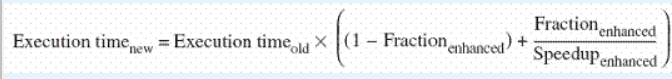
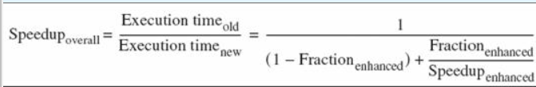

- Amdahl's Law gives us a handy way to estimate(估计) the performance improvement we can expect when we upgrade a system component.

Example:

Suppose we can upgrade a CPU to make it 50% faster for $10,000 or upgrade its disk drives for $7,000 to make them 250% faster.

- Processes spend 70% of their time running in the CPU and 30% if their time waiting for disk service.

An upgrade of which component would offer the greater benefit for the lesser cost?

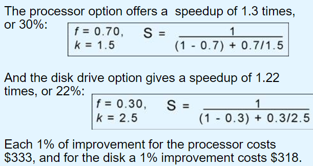

## I/O Architerctures

We define input/output as a subsystem of components that moves coded data between external devices and a host system(CPU Mainmemory).

I/O subsystems include:

- Blocks of main memory that are devoted to I/O functions.
- Buses that move data into and out of the system.
- Control modules in the host and in peripheral devices.
- Interfaces to eaxternal components such as keyboards and disks.
- Cabling or communiactions links between the host system and its peripherals.

Model I/O configuration:

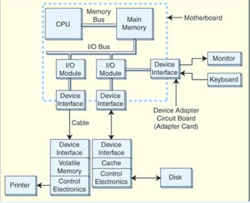

- I/O modules take care of moving data between main memory and a particular device interface.
- Interfaaces are designed specifcally to communicate with **certain types of devices**.
- Interfaces handle the details of making sure that devices are ready for the next batch of data.
- External devices that handle large blocks of data are often **equipped with buffer memory.**
- Buffers allow the host to send **lot of data** to peripheral devices in the fastest manner possible,**without waiting until slow mechanical devices have actually written the data.**
- Disk drive:fast cachem printer:slower RAM.(DRAM)
- Device control circuits take data to or from buffers and assure that it gets where it's going.

### I/O Control Methods

I/O can be controlled in four general ways:

- Programmed I/O
- Interrupt-Driven I/O
- Direct Memory Access(DMA)
- Channel I/O

#### Programmed I/O

- Programmed I/O reserves **a register for each I/O device**. Each register is **continually polled to detect data arrival.**

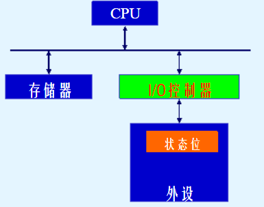

- Benefit: Have programmatic control over the behavior of each device,make adjustments to the number and types of devices,polling priorities and intervals.
- Problem: The CPU is **in a continual "busy wait" loop until** it starts servicing an I/O request.
- It suited for **special-purpose systems** such as automated teller machines(ATM) and systems that control or monitor environment events.

#### Interrupt-Driven I/O

- Interrupt-Driven I/O **allows the CPU to do other things** until I/O is requested.
- Interrupts **use a bit in the CPU flags register(interrupt flag)**.

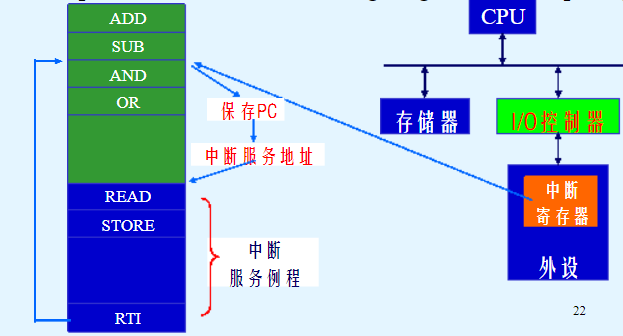

#### Direct Memory Access(DMA)

- Programmed I/O and interruput-driven I/O,the CPU runs:

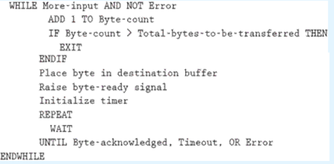

These intructions are simple enough to be programmed **in a dedicated chip**.This is the idea behind **direct memory access(DMA)**.

When a system uses DMA,the CPU offloads execution of tedious I/O instructions.(当使用DMA时,CPU就不会进行繁琐的IO指令)

CPU provides the DMA controller:

- the location of the bytes to be transferred.
- the number of bytes to be transferred.
- the destination decive or memory address.

This communication usually **takes place through special I/O registers** on the CPU.

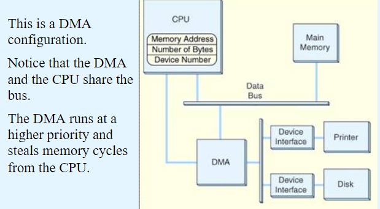

- DMA uses memory cycles that would otherwise be used by the CPU.This is called **cycle stealing.**

#### Channel I/O

- Channel I/O uses **dedicated I/O processors**.
- Programmed I/O transfers data **one byte** at a time.
- Interrupt-driven I/O can handle data **one byte at a time or in small blocks.**
- DMA methods are **all block oriented.**

Very large systems employ channel I/O and **channel I/O consists of one or more I/O processors that control various channel paths.**

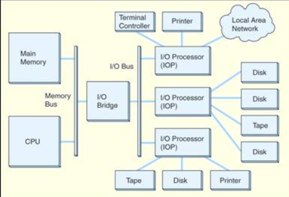

Slower devices such as terminals and printers are combined into **a single faster channel.**

On IBM mainframes,multiplexed channels are called **multiplexor channels**(多路复用器管道),the faster ones are called **selector channels**(选择器通道)

- Channel I/O is distinguished from DMA **by the intelligence of the IOPS**.
- The IOP can transfer entire files or groups of files **independent of the host CPU**.
- The host has **only to create** the program insructions for the I/O operation and **tell the IOP where to find them.**

### I/O Bus Operation

- A system bus is a resource **shared among many components** of a computer system.
- Access to this shared resource **must be controlled**.This is why a control bus is required.

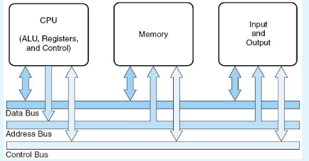

- I/O buses,unlike memory buses,operate asynchronously(I/O总线只能异步,不能同步).

Distinguish sysnchronous from asynchronous(区分同步和异步)

a synchronous transfer requires both the sender and the receiver to **share a common clock for timing.**

Example:

This is how a bus connects to a disk drive.

- The **number** of data lines is **the width of** the bus.
- The address bus has a sufficient number of conductors to uniquely identify each device on the bus.

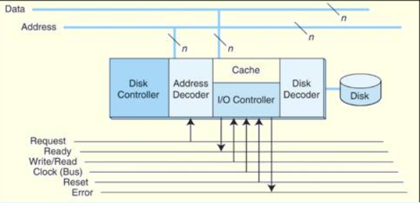

1. The DMA circuit places the address of the disk controller **on the address lines**,and **raises the Request and Write signals**.
1. With the **Request**  signal asserted,decoder circuits in the controller interrogate the address lines.(控制器中的译码电路查询地址总线)
1. Upon its own address,the decoder **enables the disk control circuits.** If the disk is available for writing data, the controller asserts a **signal on the Ready line**. At this point,the handshake beteen the DMA and the controller is complete.With the **Ready signal raised**,**no** other devices may use the bus.
1. The DMA circuits then place the data on the lines and **lower the Request signal**.
1. When the disk controller sees **the Request signal drop**,it transfer the byte from the data lines to the disk buffer, and **then lowers its Ready signal.**

- Many real I/O buses do not have separate address and data lines.

## Magnetic Disk Technology

Magnetic disks offer **large** amounts of durable storage that can be accessed **quickly**.

- Disk drives are called **random access storage devices**,because blocks of data can be accessed according to their location on the disk.

DISK:

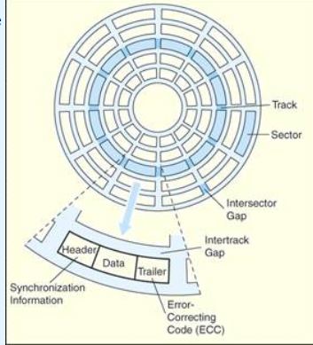

- Disk tracks are numbered from the outside edge,starting with zero.

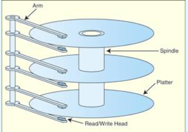

- Hard disk platters(盘片) are mounted on spindles(转轴).
- Read/Write heads(磁头) are mounts on a comb that swings radially to read the disk.
- Data blocks are addressed by their cylinder,surface and sector.
- There are a number of electromechanical properties of hard disk drives that determine **how fast** its data can be accessed.
- **Seek time** is the time that it takes for a disk arm to move into postiion over the desired cylinder.(驱动臂到指定磁道所需时间)
- **Rotation delay** is the time that it takes for the desired sector to move into postion beneath the read/write head.
- Seek time + rotational delay = access time.
- Transfer time: access time + the time that read data from the disk.

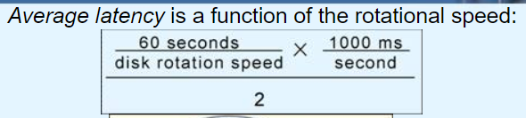